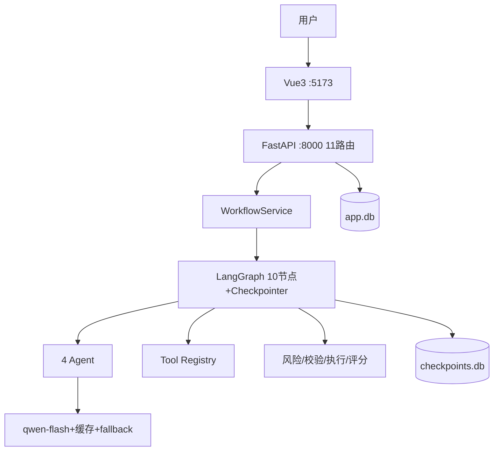

# DataGuard AI 项目深度拆解文档（面试准备版）

> 生成日期：2026-08-29 · 基于当前代码库（commit abe8aef，90 测试全绿）
> 用途：面试前深度复习 · 所有结论均标注 [事实]/[推断]

---

## 01. 项目概览

**DataGuard AI —— 企业数据治理 Agent 平台**

- **解决的问题**：脏数据清洗效率低（人工小时级）、清洗操作不可逆风险高、治理效果无法量化
- **目标用户**：企业数据工程师/分析师
- **核心业务**：数据接入（CSV/网页/数据库）→ Agent 流水线发现质量问题 → 人工审批高危操作 → 执行清洗 → 质量评分前后对比 → 导出报告
- **技术栈**：Python/FastAPI/LangGraph/SQLAlchemy/SQLite/pandas + Vue3/Element Plus/Pinia/TS + 阿里百炼 qwen-flash
- **规模**：后端 ~40 文件（90 测试）、前端 8 页面 + 9 组件
- **完成度**：核心功能 + 工程化（CI/认证/部署/可观测性）全部完成
- **技术债务**：9 个 unused-vars warning、workflow_service 23KB 单体、物理级联删除

---

## 02. 目录结构

```text
backend/app/
├── main.py                 # 入口：注册 11 个 router + CORS + lifespan(init_db/init_tools)
├── graph/                  # ★LangGraph 工作流
│   ├── builder.py          #   图构造（10 节点 + 5 条件边 + checkpointer）
│   └── nodes.py            #   节点实现（一节点一职责）
├── agents/                 # LLM Agent（只决策不计算）
│   ├── base.py             #   公共 LLM 调用 + prompt 加载（Pydantic 约束）
│   ├── profiler/inspector/planner/supervisor.py
├── tools/                  # 确定性 Python 工具（Registry 注册制）
│   ├── registry.py         #   工具注册表（Agent 唯一取工具入口）
│   ├── data/profiler.py    #   profile_dataset 统计测量
│   ├── data/detectors.py   #   数据质量检测
│   └── cleaning/           #   清洗工具（normalizers + high_risk）
├── governance/             # 治理规则引擎
│   ├── execution.py        #   ★执行引擎（唯一动数据处 + 硬拦截）
│   ├── risk_engine.py      #   风险分级
│   ├── plan_validator.py   #   计划合法性校验
│   └── validator.py        #   质量评分
├── services/               # 业务服务
│   ├── workflow_service.py #   ★编排（启动/审批/恢复/持久化）
│   ├── dataset_service.py  #   数据集 CRUD
│   ├── auth_service.py     #   JWT 认证
│   └── report_service.py   #   PDF/HTML 报告
├── api/                    # 11 个 router
├── schemas/                # Pydantic 模型（LLM 输出约束 + API 契约）
├── llm/providers.py        #   LLM 客户端 + LRU 缓存 + fallback
├── trace/collector.py      #   Trace 统一采集器
└── storage/                # 双库：app.db + checkpoints.db + 对象存储

frontend/src/
├── main.ts / router / App.vue / stores/app.ts（Pinia 持久化）
├── views/（8 页面：Dashboard/Workflow/Issues/Approval/DataSource/Settings/SystemStatus/Login）
└── components/（9 组件：ReportDrawer/QualityTrend/RunningTasks/TracePanel/WorkflowGraph/AgentDetail/IssueCard/QualityChart/DiffViewer）
```

---

## 03. 技术栈

| 技术 | 用途 | 位置 | 为什么需要 |
|---|---|---|---|
| FastAPI | Web 框架 | main.py + api/ | 异步 + Pydantic 双赢 |
| LangGraph | 工作流 | graph/ | interrupt 审批 + Checkpointer + 可视化 |
| SQLite×2 | 业务库+状态库 | storage/ | 职责隔离、零运维 |
| SQLAlchemy | ORM | models.py | 表管理 + 幂等迁移 |
| pandas | 数据处理 | tools/+governance/ | 统计 + dtype 安全拦截 |
| 百炼 qwen-flash | LLM | llm/providers.py | 免费 + OpenAI 兼容 |
| pyjwt | 认证 | auth_service.py | 无状态 JWT |
| Vue3+Element+Pinia | 前端 | frontend/ | 组合式 + 企业组件 + 状态持久化 |

---

## 04. 整体架构



四层单向调用：**API(鉴权) → Service(编排) → Graph(状态机) → 基础设施(Agent/Tool/DB)**
无循环依赖；Agent 无数据写权限；Execution Engine 是唯一动数据处。

---

## 05. 项目入口

```text
用户 → 浏览器 → http://localhost:5173 → 登录(JWT) → 数据源页上传/注册数据集
→ 治理工作台发起治理 → POST /api/workflow/start
→ WorkflowService.start → graph.invoke(initial, {thread_id})
→ 10 节点流水线 → 审批中断/恢复 → SUCCESS/FAILED
```

---

## 06. 核心模块

| 模块 | 职责 | 关键文件 |
|---|---|---|
| 工作流 | 流程状态机 | graph/nodes.py + builder.py |
| 编排 | 启停/审批/持久化 | services/workflow_service.py |
| 执行 | 唯一动数据 + 硬拦截 | governance/execution.py |
| Agent | 决策（计划/判断） | agents/*.py |
| LLM 基础设施 | 缓存/fallback/超时 | llm/providers.py |

---

## 07. 核心业务流程

```text
上传数据 → 注册数据集 → supervisor 路由 → profiler 画像 → inspector 发现问题
→ planner 计划 → plan_validator 校验 → risk 分级
→ [高危→审批 interrupt 暂停 → 逐条审批 → Command(resume)]
→ execution 执行（DRY_RUN 预览/EXECUTE 真跑）
→ validator 评分（前后对比）
→ [FAIL & <3次 → reflection 反思 → planner 重规划]
→ END + 报告
```

---

## 08. 数据流

```text
CSV → 对象存储 + app.db(datasets)
→ DataGovernanceState 在节点间增量流动
→ issues/cleaning_plans/executions/validations/approvals 落库
→ 清洗后文件 → outputs/{dataset_id}/cleaned.csv（对象存储）
→ 报告 → report_service（HTML/PDF）
```

数据库源：SQL 防火墙只读 → 治理结果写 Shadow Table `{table}_agent_{suffix}`，不碰生产表。

---

## 09. 控制流

见 07 业务流程；关键点：LangGraph 条件边（plan_validator→risk/planner/END、risk→approval/execution、validator→END/reflection）+ interrupt 暂停恢复。

### 核心链路 A：完整治理链路（面试必讲）
```text
用户上传 → 数据集注册 → graph.invoke 启动 → 10 节点流水线 → 审批中断/恢复 → 质量验证 → 报告
为什么：治理必须"先诊断后动刀"：profile→inspector 先摸清问题，planner 才制定计划；
审批在风险分级之后（LOW 自动、高危人工），既保效率又保安全；validator 最后证明"确实变好了"。
```

### 核心链路 B：Human-in-the-loop 审批链路（差异化亮点）
```text
risk_node 判定需审批 → approval_node 调 interrupt() 挂起线程
→ workflow_service 检测 __interrupt__ → 状态 WAITING_APPROVAL → 前端轮询展示待审批列表
→ 用户逐条 approve/reject → submit_decisions → Command(resume=decision)
→ execution_node 只执行 APPROVED 的动作（rejected 过滤掉）→ 继续后续节点
为什么：高危清洗（删重复）不可逆必须人拍板；LangGraph interrupt 让"暂停/恢复"成为框架能力，
不用自写任务队列；审批动作逐条记录（approvals 表）可审计。
```

### 核心链路 C：LLM 可靠性链路（工程化亮点）
```text
Agent.run() → get_llm_client() → OpenAICompatibleClient.chat()
→ 构造 prompt key → _cache_get 命中? 直接返回（省 token）
→ 未命中 → 主模型 qwen-flash 请求 → 失败自动切 fallback qwen-turbo（同 Key）
→ Pydantic 解析输出 → 校验 → 缓存 _cache_put → 返回
为什么：LLM 是"不可靠的第三方"，必须加缓存（同数据重复治理）、fallback（主模型挂了还能跑）、
schema 约束（输出必须是结构化 JSON，防幻觉污染状态）。
```

### 核心链路 D：安全红线链路（面试差异化记忆点）
```text
planner 可能乱计划（LLM 波动）→ plan_validator 校验计划格式 → execution_node 执行时
ExecutionEngine 硬拦截：数值列（int/float dtype）一律禁止 delete_duplicate → failed + 提示
为什么：数据删除不可逆，安全规则不能依赖 LLM 自觉，必须代码层兜底；
这就是"AI 决策 + 确定性执行"的边界：LLM 可以建议，但红线由代码说了算。
```

---

## 10. 模块调用关系

```text
api/*.py → services/workflow_service.py → graph/builder.py(graph.invoke)
graph/nodes.py → agents/*.py → llm/providers.py
              → tools/registry.py → tools/cleaning|data
              → governance/*.py
              → trace/collector.py → trace_events 表
services/workflow_service.py → storage/database.py（双库）
```

---

## 11. 核心代码（S级）

### 11.1 审批中断恢复（workflow_service.py:360）
```python
result = self._graph.invoke(Command(resume=decision), config={"configurable": {"thread_id": run_id}})
```
线程销毁后靠 checkpoints.db + thread_id 精确恢复中断点。

### 11.2 安全硬拦截（execution.py:68-76）
```python
if action.tool == "delete_duplicate" and pd.api.types.is_numeric_dtype(working[action.column]):
    results.append(self._failed(action, "数值列禁止 delete_duplicate（硬性安全规则）"))
```
数据安全不依赖 LLM 自觉。

### 11.3 职责边界（nodes.py:98-112）
```python
profile_tool = get_registry().get("profile_dataset")   # 统计走 Tool
profile = DatasetProfile.model_validate(profile_dict)  # Pydantic 校验
semantic, usage = _profiler_factory().run(profile)     # LLM 只解释
```

### 11.4 LLM 缓存（providers.py）
```python
# key = sha256(system+user)；_cache_get/_cache_put；LRU 128 条 + TTL 1h
_cache_key = hashlib.sha256((system + user).encode()).hexdigest()
```

---

## 12. 技术选型分析（因果链）

| 技术 | 业务问题 → 为什么选它 |
|---|---|
| LangGraph | 要审批中断 → interrupt+Command(resume)+Checkpointer 原生解决 |
| FastAPI | LLM 长调用异步 + Pydantic 统一校验/输出解析 |
| 双 SQLite | 业务数据 vs 状态数据职责隔离；可平滑升级 PG |
| 百炼 | 免费 + OpenAI 兼容（换模型只改配置） |
| pandas | 生态熟 + is_numeric_dtype 实现安全拦截 |
| 进程内 LRU | 单机无分布式需求，YAGNI；config 预留 redis_url |
| Vue3 | 组合式 + 企业组件全 + Pinia 跨页持久化 |

---

## 13. 技术方案对比

| 技术点 | 当前 | 替代 | 选当前原因 |
|---|---|---|---|
| 工作流 | LangGraph | 自写状态机/Prefect | interrupt 原生 |
| 数据库 | SQLite×2 | MySQL/PG | 零运维+隔离 |
| 缓存 | 进程内 LRU | Redis | 单机够用+YAGNI |
| LLM | qwen-flash | DeepSeek/GPT-4o | 免费+兼容 |
| 前端 | Vue3 | React | 企业组件成熟 |

---

## 14. 架构设计思想

- **分层架构**：API/Service/Graph/基础设施，单向调用
- **状态机/工作流**：LangGraph 固话流程
- **依赖注入**：agent factories（可 monkeypatch 测试）
- **策略模式**：ExecutionMode（DRY_RUN/EXECUTE）
- **工厂模式**：Tool Registry + get_llm_client
- **接口抽象**：TraceCollector ABC / ObjectStorage 接口
- **AI 哲学**：LLM 只决策，确定性 Python 执行（Agent-Tool 职责互斥）

---

## 15. 关键技术原理

### Human-in-the-loop（LangGraph interrupt）
```text
approval_node 调 interrupt(payload)
→ 执行栈抛出 __interrupt__ → 图暂停，线程正常返回
→ workflow_service 检测 __interrupt__ → 状态 WAITING_APPROVAL + 持久化待审批项
→ 用户审批 → Command(resume=decision) → 从中断点恢复
→ execution_node 根据 decision 过滤 action
```

### LLM 可靠性
```text
LRU 缓存（sha256 prompt key / 128 条 / TTL 1h）→ 省 token
fallback（qwen-flash → qwen-turbo 同 Key）→ 主挂了还能跑
180s 超时 + 2 次重试 → 卡死不拖垮
Pydantic model_validate → 防幻觉结构污染
```

---

## 16. 运行时验证

- 后端 90 tests passed（fake LLM + 临时 SQLite）
- 前端 type-check 0 error / lint 0 error / build 成功
- CI：GitHub Actions 两 job 全绿
- 实测：一次治理 ~3 分钟、质量 93.93→95.44、成功率 80.4%、Docker 全流程（上传→治理→PDF→重启持久化）

---

## 17. 潜在问题

| 级别 | 问题 |
|---|---|
| Critical | 物理级联删除无软删除；默认 admin 无用户管理 |
| High | workflow_service 单体 23KB；SQLite 并发写锁；缓存重启清零 |
| Medium | CORS 白名单写死；大 CSV 全量加载；平均耗时依赖 trace 脏数据（已过滤） |
| Low | Workflow.vue 30KB；9 个死代码 warning |

---

## 18. 优化方案

1. 软删除 + 回收站（数据安全第一优先级）
2. workflow_service 拆分（Executor/ApprovalService/Persistence）
3. PostgreSQL（config 已预留）+ WAL
4. 缓存持久化（SQLite/Redis，config 已预留）
5. CORS 环境变量化
6. 分块读取大 CSV
7. workflow_runs 加 duration_seconds（替代 trace 聚合）
8. 前端组件拆分

---

## 19. 面试问题（15 高频）

Q1 介绍项目 → STAR 30 秒开场
Q2 你负责什么 → 三个自研设计（职责互斥/审批/双库）
Q3 解决什么真实问题 → 效率/安全/可验证
Q4 为什么 LangGraph → 审批中断刚需
Q5 为什么双 SQLite → 职责隔离+可迁移
Q6 为什么不用 Redis → 单机 YAGNI+预留演进
Q7 LLM 不可靠怎么办 → 四层防护（Pydantic/确定性执行/硬拦截/Validator）
Q8 模块怎么拆 → 四层单向调用
Q9 用户量 10 倍 → Redis+Celery+PG
Q10 重启任务会怎样 → 审批中可恢复，执行中断（已识别短板）
Q11 审批怎么实现 → 逐条 interrupt+Command(resume)
Q12 并发怎么防 → 上限3+取消级联+独立 thread_id
Q13 质量评分怎么算 → before/after 加权
Q14 最大难点 → LLM 不可靠 vs 数据不可逆（三层防御）
Q15 重新设计改什么 → 软删除/PG/Redis/拆分

---

## 20. 学习路线（还想深入看什么）

1. LangGraph 官方文档：interrupt/Command/resume/Checkpointer 原理
2. FastAPI 依赖注入 + Pydantic v2
3. SQLite WAL 模式与并发
4. LRU 缓存实现（OrderedDict + TTL）
5. Vue3 组合式 API + Pinia 持久化

---

## 21. 项目知识地图

```text
项目
├── 1. 背景：脏数据清洗效率/安全/可验证
├── 2. 技术栈：FastAPI/LangGraph/SQLite/pandas/qwen-flash/Vue3
├── 3. 架构：4 层单向调用 + 双库
├── 4. 核心业务：10 节点流水线 + 审批 + 重规划
├── 5. 核心代码：nodes.py / workflow_service.py / execution.py
├── 6. 技术选型：LangGraph(interrupt) / 双SQLite / LRU
├── 7. 设计思想：职责互斥 / HITL / 安全硬拦截
├── 8. 问题：软删除 / 单体 / 并发 / 缓存
└── 9. 面试表达：15 问 + 金句
```

---

## 22. 一页纸速查卡 + 面试金句

```
DataGuard AI = 数据治理 Agent 平台
一句话：LLM 发现脏数据 → 人工审批 → Python 清洗 → 质量评分证明有效

架构 4 层：API(鉴权) → Service(编排) → LangGraph(状态机) → Agent/Tool/DB
10 节点：supervisor→profiler→inspector→planner→plan_validator→risk→
        approval(中断)→execution→validator→reflection(重规划,≤3次)

三个灵魂设计：
① Agent 只决策不计算（LLM 输出计划，pandas 执行）
② Human-in-the-loop（interrupt + Command(resume) + checkpoints.db）
③ 双库隔离（app.db 业务 / checkpoints.db 状态）

技术栈：FastAPI + LangGraph + 双SQLite + pandas + 百炼qwen-flash
        Vue3 + Element Plus + Pinia + ECharts

安全红线：数值列禁 delete_duplicate（执行层 dtype 硬拦截，不信 LLM）
可靠性：LRU缓存(128/TTL1h) + fallback qwen-turbo + 180s超时 + Pydantic约束
工程化：JWT认证 / Docker(8080/8010) / CI(GitHub Actions) / 90测试 / type-check+lint

核心指标：一次治理 ~3 分钟，质量评分 93.93→95.44，成功率 80.4%
```

### 面试金句（可直接背）

| 场景 | 金句 |
|---|---|
| 讲架构 | "四层单向调用，Agent 拿不到数据写权限，Execution Engine 是唯一动数据的地方" |
| 讲难点 | "AI 项目的安全边界不能依赖模型自觉，必须由确定性代码兜底" |
| 讲选型 | "业务要审批中断 → LangGraph interrupt 原生解决；自写状态机恢复易重复执行=数据灾难" |
| 讲演进 | "SQLite 是开发友好选择，config 已预留 DG_DATABASE_URL，生产一行切换 PostgreSQL" |
| 讲不足 | "三个短板我清楚：删除无回收站、SQLite 并发锁、缓存重启清零——都有演进方案" |

---

## 23. 最终记忆清单（10 条）

1. 项目本质：脏数据清洗从人工小时级 → Agent 分钟级，可审计可验证
2. 整体架构：四层单向调用，无循环依赖
3. 核心流程：诊断→计划→审批→执行→验证→反思(≤3)→报告
4. 最重要数据流：DataGovernanceState 节点间增量流动
5. 核心模块：graph/nodes.py + workflow_service.py
6. 最重要选型：LangGraph（interrupt 审批）
7. 为什么选：业务要中断等人 → interrupt 原生
8. 最大难点：LLM 不可靠 vs 数据不可逆 → 三层防御
9. 最大缺陷：物理删除 / SQLite 并发 / 缓存重启清零
10. 继续开发：软删除 → PG → Redis → 队列 → 拆分
